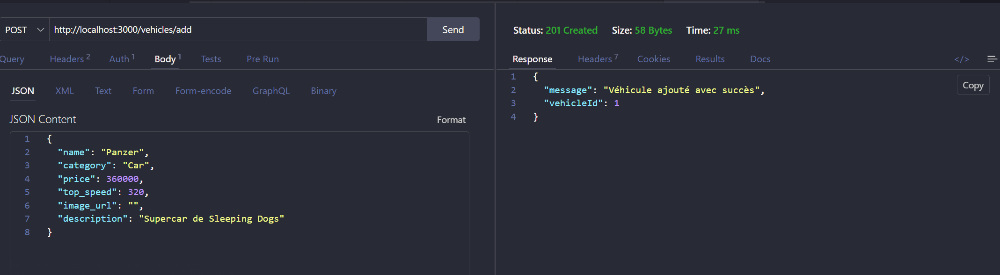

# Sleeping-dogs_garage

Ceci est le contenu des ECF 6 et 7 (les derniers) pour montrer ma compréhension des connaissances nécessaires en vue de la validation de fin de formation. 
L’interface a été gardée volontairement sobre pour mettre en avant la lisibilité du code, la séparation front/back et la robustesse des fonctionnalités.

## Stacks utilisées

- Côté backend : Node.js / Express, JSON Web Token pour l’authentification, base de données MySQL/MariaDB.
- Côté frontend : HTML / CSS / JavaScript vanilla, appels `fetch` vers l’API, `localStorage` pour le token et l’état du vote.

Fonctionnalités clés : gestion des utilisateurs (register / login), gestion des véhicules (CRUD complet), système de vote avec protection anti double-vote.

## Choses notables et petites modifications

À date, j’ai surtout préparé toute la structure de base et connecté le serveur à la base de données afin de préparer le terrain pour un projet stable.  
Je me suis simplement permis d’ajuster légèrement le schéma de dossier demandé afin de le faire correspondre un peu plus à ma façon de travailler, comme par exemple l’insertion d’un dossier `src/`, ainsi que la modification de `cars` en `vehicle`. Il s’agit certes d’un garage de jeu vidéo, mais il ne faut pas oublier la présence de nos amis motards ! (L’association pour laquelle j’ai fait le site me servant de dossier de fin de formation m’en voudrait sans doute, eheh.)

## fonctionnement backend :

voici déjà ma base de donnée, créée et utilisée pour l'occasion.

et voici ici la suite de requêtes postman utilisées pour vérifier les différentes étapes :

1. le lien entre le localhost et l'API.

2. l'inscription d'un compte utilisateur.

3. la connexion au dit compte utilisateur.

4. l'ajout d'un premier véhicule :

5. Modification du dit véhicule.

6. Suppression du dit véhicule.

7. vote pour un véhicule :

8. obtenir tous les véhicule.

9. Un véhicule pour les gouverner tous... non, attendez... 

10. voir les votes

## la logique frontend

Voilà une idée de la logique front : 

Un formulaire "ajout" qui prends la place d'un modificateur quand on appuie sur le bouton lié d'un véhicule (pour compte connecté)

Des cartes assez simples pour les lister et pour les modales, afin de démontrer l’utilisation de `getElementById` et la manipulation du DOM.

Une barre de recherche fonctionnelle qui peut filtrer les véhicules selon leur nom ou leur catégorie :

Tout est ici bien connecté et fonctionnel sur cette logique, j'ai pensé à la petite subtilité demandée, comme le fait d'ajouter un bouton visuellement différent pour ce qui est du vote déjà accompli.

Et voici un exemple de fonction de mon `script.js` (front) avec `fetch` pour récupérer les données en backend :

## Interface JavaScript dynamique

L’interface repose sur une logique JavaScript dynamique permettant de mettre à jour l’affichage sans rechargement complet de la page.  
Par exemple, les véhicules sont affichés dynamiquement depuis les données récupérées en backend via `fetch`, le formulaire change de rôle selon le contexte (ajout ou modification), les modales s’ouvrent selon le véhicule sélectionné, la barre de recherche filtre les résultats en temps réel, et le bouton de vote adapte visuellement son état lorsqu’un vote a déjà été effectué.

## quelque chose à ajouter ?

L’interface visuelle reste extrêmement simple, puisque je me suis concentré sur l’aspect technique du travail afin d’être certain de ne rien rater d’important au niveau du barème.  
Tout le reste me semble assez accessible via le code fourni ici. Merci donc d’avoir lu tout ceci et bonne journée !